# RAG-Ready Web Corpus Builder

A **production-grade web crawling and preprocessing pipeline** that converts raw websites into RAG-ready, searchable document datasets. Ships with a **CLI**, **Python API**, **Django Web UI**, and **REST API**.

## System Architecture

```mermaid
graph TB
    subgraph "User Interfaces"
        CLI["🖥️ CLI<br/><small>Click + Rich</small>"]
        WEB["🌐 Django Web UI<br/><small>Tailwind CSS</small>"]
        API["📡 REST API<br/><small>Django REST Framework</small>"]
    end

    subgraph "Pipeline Engine"
        direction TB
        CRAWL["1️⃣ Crawl<br/><small>Async BFS · httpx</small>"]
        EXTRACT["2️⃣ Extract<br/><small>Trafilatura + BS4</small>"]
        PREPROCESS["3️⃣ Preprocess<br/><small>Dedup · Language Filter</small>"]
        CHUNK["4️⃣ Chunk<br/><small>4 Strategies · tiktoken</small>"]
        EMBED["5️⃣ Embed<br/><small>sentence-transformers</small>"]
        EXPORT["6️⃣ Export<br/><small>JSONL · Parquet · HF Dataset</small>"]
    end

    subgraph "Data & Storage"
        CONFIG["⚙️ YAML Config<br/><small>Pydantic v2</small>"]
        SQLITE[("🗄️ SQLite<br/><small>Job tracking · Chunks</small>")]
        OUTPUT["📁 Output Files<br/><small>Corpus + Stats</small>"]
    end

    CLI --> CRAWL
    WEB --> CRAWL
    API --> CRAWL

    CRAWL --> EXTRACT --> PREPROCESS --> CHUNK --> EMBED --> EXPORT

    CONFIG -.->|configures| CRAWL
    CRAWL -.->|results| SQLITE
    EXPORT --> OUTPUT
    CHUNK -.->|chunks stored| SQLITE
```



### Component Interaction Flow


### Data Model


## Features

### Core Pipeline
- **Async web crawler** — BFS traversal, robots.txt compliance, per-domain rate limiting, configurable concurrency, exponential backoff retry
- **Content extraction** — [Trafilatura](https://trafilatura.readthedocs.io/) precision mode + BeautifulSoup fallback; extracts titles, headings, tables (as markdown), code blocks, links, images, and rich metadata
- **Text preprocessing** — whitespace normalization, language detection/filtering via langdetect, exact dedup (SHA-256) + near-duplicate detection (128-bit SimHash with xxhash word trigrams)
- **Smart chunking** — 4 strategies (recursive, sentence, semantic, sliding window) with configurable token sizes using tiktoken (`cl100k_base`)
- **Optional embeddings** — sentence-transformers integration with L2 normalization, configurable batch size and device (CPU/CUDA/MPS)
- **Flexible export** — JSONL (optional gzip), Parquet (Snappy compression), or HuggingFace Dataset (Arrow) with stats sidecar

### Web UI & API
- **Django dashboard** — real-time job monitoring with live progress polling
- **Visual job creation** — form-based configuration with validation
- **Chunk browser** — searchable, filterable, paginated exploration of results
- **Terminal-style log viewer** — syntax-highlighted pipeline logs
- **REST API** — full CRUD via Django REST Framework with browsable API
- **Django Admin** — built-in admin panel for direct database management

### Developer Experience
- **Rich CLI** — progress bars, summary tables, corpus inspector
- **YAML configuration** — fully declarative pipeline config with Pydantic v2 validation
- **36 unit tests** — comprehensive test suite with pytest + pytest-asyncio

---

## Installation

```bash
# Clone the repository
git clone https://github.com/somesh-banerjee/RAG-Ready-Web-Corpus-Builder-using-OpenClaw.git
cd RAG-Ready-Web-Corpus-Builder-using-OpenClaw

# Create a virtual environment
python -m venv .venv
source .venv/bin/activate  # macOS/Linux
# .venv\Scripts\activate   # Windows

# Install the package (includes Django + all dependencies)
pip install -e .

# With embedding support (sentence-transformers + torch)
pip install -e ".[embeddings]"

# With dev tools (pytest, ruff, mypy)
pip install -e ".[dev]"
```

### Requirements

- Python 3.10+
- ~200 MB disk space (dependencies)
- Internet access for crawling

---

## Quick Start

### Option 1: CLI

```bash
# Simplest usage — crawl a site and build a corpus
rag-corpus crawl https://docs.python.org/3/tutorial/

# Multiple seed URLs with full options
rag-corpus crawl https://docs.python.org https://wiki.python.org \
  --max-pages 200 \
  --max-depth 3 \
  --chunk-size 512 \
  --format parquet \
  --output ./my-corpus

# Use a YAML config file
rag-corpus crawl --config pipeline_config.yaml https://example.com

# Generate embeddings alongside chunks
rag-corpus crawl https://docs.python.org/3/tutorial/ \
  --embed \
  --embed-model all-MiniLM-L6-v2

# Generate a default config file
rag-corpus init-config --output my_config.yaml

# Inspect an exported corpus
rag-corpus inspect output/corpus.jsonl
```

### Option 2: Web UI

```bash
# Run database migrations (first time only)
python web/manage.py migrate

# Start the development server
python web/manage.py runserver 8000
```

Open **http://127.0.0.1:8000** → click **"New Crawl Job"** → fill in the form → click **"Start Crawl"**.

### Option 3: Python API

```python
from rag_corpus_builder.config import PipelineConfig
from rag_corpus_builder.pipeline import Pipeline
import asyncio

config = PipelineConfig(
    crawl={"seed_urls": ["https://docs.python.org/3/tutorial/"], "max_pages": 50},
    chunk={"strategy": "recursive", "chunk_size": 512},
    export={"format": "jsonl", "output_dir": "output"},
)

pipeline = Pipeline(config)
asyncio.run(pipeline.run())
```

### Option 4: REST API

```bash
# Create and start a crawl job via API
curl -X POST http://127.0.0.1:8000/api/jobs/ \
  -H "Content-Type: application/json" \
  -d '{
    "name": "Python Docs",
    "seed_urls": ["https://docs.python.org/3/tutorial/"],
    "max_pages": 50,
    "chunk_strategy": "recursive",
    "chunk_size": 512,
    "export_format": "jsonl"
  }'

# Check job status
curl http://127.0.0.1:8000/api/jobs/{job-id}/status/

# List all jobs
curl http://127.0.0.1:8000/api/jobs/

# Get chunks for a completed job
curl http://127.0.0.1:8000/api/jobs/{job-id}/chunks/

# Cancel a running job
curl -X POST http://127.0.0.1:8000/api/jobs/{job-id}/cancel/
```

---

## Web UI — Detailed Guide

### Setup

```bash
# 1. Install dependencies (already done if you ran pip install -e .)
pip install -e .

# 2. Run database migrations
python web/manage.py migrate

# 3. (Optional) Create a superuser for Django Admin
python web/manage.py createsuperuser

# 4. Start the development server
python web/manage.py runserver 8000
```

### Pages Overview

#### Dashboard (`/`)

The main landing page showing:

| Element | Description |
|---------|-------------|
| **Stats Cards** | 4 cards showing total completed jobs, pages crawled, chunks generated, and total tokens |
| **Running Indicator** | Pulsing dot with count of currently running jobs |
| **Jobs Table** | All jobs with name, status badge, pages/chunks counts, progress bar, and creation time |
| **Status Badges** | Color-coded: 🟡 Pending, 🔵 Running, 🟢 Completed, 🔴 Failed, ⚪ Cancelled |
| **Quick Actions** | Click any job row to view details; "New Crawl Job" button in the header |

#### New Crawl Job (`/jobs/new/`)

A multi-section form to configure and launch a pipeline:

| Section | Fields | Description |
|---------|--------|-------------|
| **Basic Info** | Job Name | Human-friendly label for the job |
| **Crawl Settings** | Seed URLs, Max Pages, Max Depth, Concurrency, Delay, Respect Robots | Controls the web crawler behavior |
| **Chunking Settings** | Strategy, Chunk Size, Chunk Overlap | How documents get split into retrieval-ready pieces |
| **Preprocessing** | Target Languages, Enable Deduplication | Language filtering and duplicate removal |
| **Export Settings** | Output Format, Compress | JSONL / Parquet / HuggingFace Dataset |

**Seed URLs** accepts one URL per line. All URLs must start with `http://` or `https://`.

**Chunking strategies:**
| Strategy | Best For |
|----------|----------|
| `recursive` | General purpose — progressively splits by paragraphs → sentences → words |
| `sentence` | QA datasets — respects sentence boundaries |
| `semantic` | Topic-coherent chunks — splits on paragraph breaks |
| `sliding_window` | Dense retrieval — fixed token window with configurable overlap |

After clicking **"Start Crawl"**, the pipeline launches in a background thread and you're redirected to the job detail page.

#### Job Detail (`/jobs/<id>/`)

Live monitoring page with three tabs:

**Status Banner:**
- Animated progress bar with percentage (polls every 2 seconds via AJAX)
- Current pipeline stage indicator (Crawling → Extracting → Preprocessing → Chunking → Embedding → Exporting)
- Elapsed time counter
- Auto-reloads when the job completes, fails, or is cancelled

**Stats Grid:**
| Stat | Description |
|------|-------------|
| Pages Crawled | Successfully downloaded HTML pages |
| Pages Failed | URLs that returned errors or timed out |
| Chunks | Total document chunks generated |
| Total Tokens | Sum of all chunk token counts |

**Tabs:**

| Tab | Content |
|-----|---------|
| **Chunks** | Preview of first 20 chunks with text, token count, source URL. Link to full chunk browser |
| **Configuration** | Pretty-printed JSON of the full pipeline config used |
| **Logs** | Scrollable log output with color-coded entries (errors in red, warnings in yellow, stage markers in green) |

**Actions:**
- **Cancel** button (visible for pending/running jobs) — stops the pipeline gracefully
- **Delete** button (visible for completed/failed/cancelled jobs) — removes job and all chunks

#### Chunk Browser (`/jobs/<id>/chunks/`)

Full-featured chunk exploration:

| Feature | Description |
|---------|-------------|
| **Text Search** | Filter chunks by text content (case-insensitive substring match) |
| **Source Filter** | Dropdown to filter by source URL |
| **Pagination** | 20 chunks per page with page navigation |
| **Chunk Cards** | Each card shows: chunk index badge, token count, source URL link, chunk text preview, metadata tags |
| **Clear Filters** | One-click reset of all filters |

#### Log Viewer (`/jobs/<id>/logs/`)

Terminal-style log viewer:
- Dark background with monospace font (JetBrains Mono)
- Line numbers for reference
- Color-coded output: errors (red), warnings (yellow), stage markers (green)
- **Copy** button to copy all logs to clipboard
- **Scroll to bottom** button
- Auto-scrolls to latest log on page load
- Auto-refreshes for running jobs (polls every 5 seconds)

### Django Admin (`/admin/`)

Full admin interface (requires superuser account):
- Browse, filter, and edit CrawlJob records
- View and manage CrawlJobChunk records
- Bulk delete operations
- Direct database field editing

---

## REST API Reference

Base URL: `http://127.0.0.1:8000/api/`

Browsable API available at the same URL in a browser (powered by DRF).

### Endpoints

| Method | Endpoint | Description |
|--------|----------|-------------|
| `GET` | `/api/jobs/` | List all jobs (paginated, 50 per page) |
| `POST` | `/api/jobs/` | Create and start a new crawl job |
| `GET` | `/api/jobs/{id}/` | Full job detail with config, logs, stats |
| `DELETE` | `/api/jobs/{id}/` | Delete a job and all its chunks |
| `GET` | `/api/jobs/{id}/status/` | Lightweight status for polling |
| `POST` | `/api/jobs/{id}/cancel/` | Cancel a running job |
| `GET` | `/api/jobs/{id}/chunks/` | Paginated chunks (supports `?q=` search and `?doc=` filter) |

### Create Job Request Body

```json
{
  "name": "My Crawl Job",
  "seed_urls": ["https://example.com"],
  "max_pages": 100,
  "max_depth": 3,
  "concurrency": 5,
  "delay_seconds": 1.0,
  "respect_robots": true,
  "chunk_strategy": "recursive",
  "chunk_size": 512,
  "chunk_overlap": 64,
  "export_format": "jsonl",
  "target_languages": ["en"]
}
```

All fields except `name` and `seed_urls` have sensible defaults and are optional.

### Status Response

```json
{
  "id": "550e8400-e29b-41d4-a716-446655440000",
  "status": "running",
  "progress": 65,
  "current_stage": "Chunking",
  "pages_crawled": 42,
  "pages_extracted": 38,
  "total_chunks": 156,
  "total_tokens": 78432,
  "duration": "2.3m"
}
```

### Chunk Response

```json
{
  "chunk_id": "a1b2c3d4e5f67890",
  "document_url": "https://docs.python.org/3/tutorial/introduction.html",
  "document_title": "An Informal Introduction to Python",
  "text": "Python is an easy to learn, powerful programming language...",
  "token_count": 487,
  "chunk_index": 0,
  "total_chunks": 3,
  "content_hash": "sha256...",
  "metadata_json": {"language": "en", "source_word_count": 1523}
}
```

---

## Configuration

All settings are configurable via YAML. Generate a starter config:

```bash
rag-corpus init-config
```

### Key Configuration Options

| Section | Option | Default | Description |
|---------|--------|---------|-------------|
| `crawl` | `seed_urls` | — | List of starting URLs (required) |
| `crawl` | `max_pages` | 100 | Maximum pages to crawl |
| `crawl` | `max_depth` | 3 | Maximum link-follow depth |
| `crawl` | `concurrency` | 5 | Concurrent HTTP requests |
| `crawl` | `delay_seconds` | 1.0 | Per-domain politeness delay |
| `crawl` | `respect_robots_txt` | true | Honour robots.txt |
| `extraction` | `min_content_length` | 50 | Drop pages with fewer chars |
| `preprocess` | `target_languages` | `[en]` | Keep only these languages |
| `preprocess` | `dedup_threshold` | 0.95 | SimHash similarity threshold |
| `chunk` | `strategy` | recursive | `recursive` / `sentence` / `semantic` / `sliding_window` |
| `chunk` | `chunk_size` | 512 | Target chunk size in tokens |
| `chunk` | `chunk_overlap` | 64 | Token overlap between chunks |
| `embedding` | `enabled` | false | Generate vector embeddings |
| `embedding` | `model_name` | all-MiniLM-L6-v2 | Sentence-transformers model |
| `export` | `format` | jsonl | `jsonl` / `parquet` / `hf_dataset` |
| `export` | `compress` | false | Enable gzip/snappy compression |

See [pipeline_config.yaml](pipeline_config.yaml) for the full reference with comments.

---

## Pipeline Stages — Deep Dive

```mermaid
flowchart LR
    A["🌐 Crawl"] -->|CrawlResult| B["📄 Extract"]
    B -->|ExtractedDocument| C["🧹 Preprocess"]
    C -->|ExtractedDocument| D["✂️ Chunk"]
    D -->|DocumentChunk| E["🧠 Embed"]
    E -->|DocumentChunk| F["💾 Export"]

    style A fill:#dbeafe,stroke:#3b82f6
    style B fill:#fef3c7,stroke:#f59e0b
    style C fill:#d1fae5,stroke:#10b981
    style D fill:#ede9fe,stroke:#8b5cf6
    style E fill:#fce7f3,stroke:#ec4899
    style F fill:#fed7aa,stroke:#f97316
```



### 1. Crawl
| Feature | Implementation |
|---------|---------------|
| HTTP client | `httpx.AsyncClient` with connection pooling |
| Traversal | Breadth-first search (BFS) |
| Rate limiting | Per-domain `DomainThrottler` with configurable delay |
| Robots.txt | `RobotsCache` with parser (`robotexclusionrulesparser`) |
| Concurrency | `asyncio.Semaphore` limiting parallel requests |
| Retry | `tenacity` with exponential backoff (3 attempts) |
| Filtering | HTML content-type only, URL deduplication |

### 2. Extract
| Feature | Implementation |
|---------|---------------|
| Primary extractor | Trafilatura (precision mode) |
| Fallback | BeautifulSoup4 + lxml for simpler pages |
| Extracted fields | Title, description, author, date, headings, tables (→ markdown), code blocks, internal/external links, images, meta tags |

### 3. Preprocess
| Feature | Implementation |
|---------|---------------|
| Whitespace | Normalization (collapse multiple spaces, strip) |
| Language detection | `langdetect` library with configurable target languages |
| Exact dedup | SHA-256 content hash comparison |
| Near-dedup | 128-bit SimHash with xxhash word trigrams, configurable similarity threshold |

### 4. Chunk
| Strategy | How It Works |
|----------|-------------|
| **Recursive** | Splits by `\n\n` → `\n` → `. ` → ` ` → character, respecting token budget |
| **Sentence** | Splits on sentence boundaries, merges until chunk size is reached |
| **Semantic** | Splits on paragraph breaks (`\n\n`), keeps paragraphs as coherent units |
| **Sliding Window** | Fixed-size token window sliding across text with configurable overlap |

Token counting uses tiktoken with the `cl100k_base` encoding (GPT-4 / text-embedding-ada-002 compatible).

### 5. Embed (Optional)
| Feature | Implementation |
|---------|---------------|
| Model framework | sentence-transformers (lazy-loaded) |
| Default model | `all-MiniLM-L6-v2` (384 dimensions) |
| Normalization | L2 normalization |
| Device | Auto-detection (CPU / CUDA / MPS) |
| Batching | Configurable batch size |

### 6. Export
| Format | Details |
|--------|---------|
| **JSONL** | One JSON object per line; optional gzip compression |
| **Parquet** | Columnar storage with Snappy compression via PyArrow |
| **HuggingFace Dataset** | Arrow-backed dataset on disk; compatible with `datasets.load_from_disk()` |
| **Stats sidecar** | `_stats.json` file with pipeline execution statistics |

---

## Output Format

Each chunk in the output contains:

```json
{
  "chunk_id": "a1b2c3d4e5f67890",
  "document_url": "https://docs.python.org/3/tutorial/introduction.html",
  "document_title": "An Informal Introduction to Python",
  "text": "Python is an easy to learn, powerful programming language...",
  "token_count": 487,
  "chunk_index": 0,
  "total_chunks": 3,
  "content_hash": "sha256...",
  "metadata": {"language": "en", "source_word_count": 1523}
}
```

---

## Running Tests

```bash
pip install -e ".[dev]"
pytest tests/ -v
```

Test coverage includes:
- **Chunker** — all 4 strategies, edge cases (short text, empty input, overlap handling)
- **Extractor** — HTML parsing, metadata extraction, fallback behavior
- **Preprocessor** — whitespace normalization, language filtering, SimHash deduplication
- **Config** — Pydantic validation, YAML load/save round-trip, defaults
- **Exporter** — JSONL/Parquet output, stats sidecar generation

---

## Project Structure

```
├── pyproject.toml                # Package metadata, dependencies, entry points
├── pipeline_config.yaml          # Example pipeline configuration
├── README.md
├── .gitignore
│
├── src/rag_corpus_builder/       # Core pipeline library
│   ├── __init__.py               # Package version
│   ├── config.py                 # Pydantic configuration models
│   ├── models.py                 # Data models (CrawlResult, DocumentChunk, PipelineStats)
│   ├── crawler.py                # Async BFS web crawler
│   ├── extractor.py              # HTML → structured content extraction
│   ├── preprocessor.py           # Text cleaning, dedup, language filtering
│   ├── chunker.py                # 4 chunking strategies
│   ├── embedder.py               # Optional embedding generation
│   ├── exporter.py               # JSONL / Parquet / HF Dataset export
│   ├── pipeline.py               # Pipeline orchestrator with Rich progress
│   └── cli.py                    # Click CLI (crawl, init-config, inspect)
│
├── web/                          # Django Web UI
│   ├── manage.py                 # Django management script
│   ├── __init__.py
│   ├── settings.py               # Django settings (SQLite, DRF, CORS, logging)
│   ├── urls.py                   # Root URL routing (dashboard + API + admin)
│   ├── wsgi.py                   # WSGI entry point
│   ├── static/css/custom.css     # Custom CSS
│   ├── templates/
│   │   ├── base.html             # Base layout (Tailwind CSS, navigation, footer)
│   │   └── dashboard/
│   │       ├── index.html        # Dashboard with stats cards + jobs table
│   │       ├── new_job.html      # Job creation form
│   │       ├── job_detail.html   # Job monitoring with tabs (chunks/config/logs)
│   │       ├── job_chunks.html   # Chunk browser with search + pagination
│   │       └── job_logs.html     # Terminal-style log viewer
│   └── dashboard/                # Django app
│       ├── __init__.py
│       ├── models.py             # CrawlJob + CrawlJobChunk models
│       ├── views.py              # View functions (8 views)
│       ├── forms.py              # CrawlJobForm with Tailwind widgets
│       ├── tasks.py              # Background thread pipeline runner
│       ├── admin.py              # Django admin registration
│       ├── urls.py               # Dashboard URL patterns (8 routes)
│       ├── serializers.py        # DRF serializers (List/Detail/Create/Chunk)
│       ├── api_views.py          # REST API viewset with custom actions
│       ├── api_urls.py           # API router (/api/jobs/)
│       └── migrations/           # Database migrations
│
└── tests/                        # Test suite (36 tests)
    ├── __init__.py
    ├── test_chunker.py
    ├── test_extractor.py
    ├── test_preprocessor.py
    ├── test_config.py
    └── test_exporter.py
```

---

## Environment Variables

| Variable | Default | Description |
|----------|---------|-------------|
| `DJANGO_SECRET_KEY` | dev key (insecure) | Django secret key — **set in production** |
| `DJANGO_DEBUG` | `True` | Enable/disable debug mode |
| `DJANGO_ALLOWED_HOSTS` | `*` | Comma-separated allowed hosts |
| `PIPELINE_OUTPUT_DIR` | `./output` | Default directory for corpus output files |

---

## Tech Stack

| Component | Technology |
|-----------|-----------|
| Web Crawler | httpx, asyncio, tenacity, robotexclusionrulesparser |
| Content Extraction | Trafilatura, BeautifulSoup4, lxml |
| Text Processing | langdetect, xxhash (SimHash), tiktoken |
| Configuration | Pydantic v2, pydantic-settings, PyYAML |
| CLI | Click, Rich |
| Web Framework | Django 5.x |
| REST API | Django REST Framework |
| Frontend | Tailwind CSS (CDN), vanilla JavaScript |
| Database | SQLite (swappable to PostgreSQL) |
| Embeddings | sentence-transformers, PyTorch (optional) |
| Export | PyArrow, HuggingFace Datasets |
| Testing | pytest, pytest-asyncio |

## License

MIT
